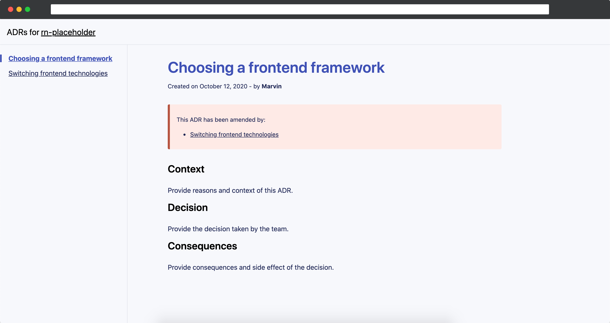
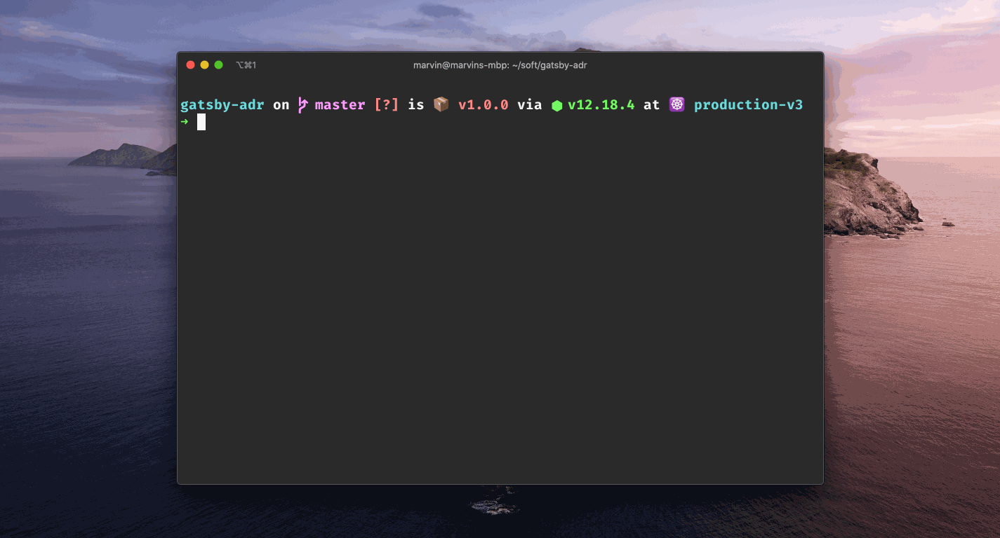

A [Gatsby](https://www.gatsbyjs.com/) template to create and manage Architecture Decision Records. Very basic, powerful.

## Usage

### Installation

```sh
# You need to have the gatsby-cli installed: https://www.gatsbyjs.com/docs/quick-start/
$ gatsby new my-project-name https://github.com/mfrachet/gatsby-template-adr
$ cd my-project-name
$ yarn dev # or npm run dev
```

### Create a new Architecture Decision Record

There is a command and a tiny script provided with the project to help you create ADRs using the command line. To do so, run the following command in a terminal:

```sh
$ yarn create-adr
```

And answer the questions. The following is a visual representation of the flow:



### Amending an ADR

Remember that ADRs are immutable and shouldn't be modified. Instead of that, we can **amend** ADRS by creating new ones referencing the one we want to modify.

If you use the CLI tool, when creating an ADR, it will ask you if the new one should amend a previously created one.

On the other hand, if you prefer to do it in markdown directly, you can reference the markdown file to amend in the `amend` key of frontmatter, like following:

```markdown
---
title: "A very exciting ADR"
date: 2020-10-12
slug: "/a-very-exciting-adr"
author: "Marvin"
pullRequest: ""
amend: "1-Choosing-a-frontend-framework.md"
---

# This is a file that needs to be amended

Some content
```

### Referencing Pull Requests

Pull Requests are great places to debate and challenge an architecture decisions. You can add the pull request link to the frontmatter content to quick track of it over time and understand even better the changes introduced.