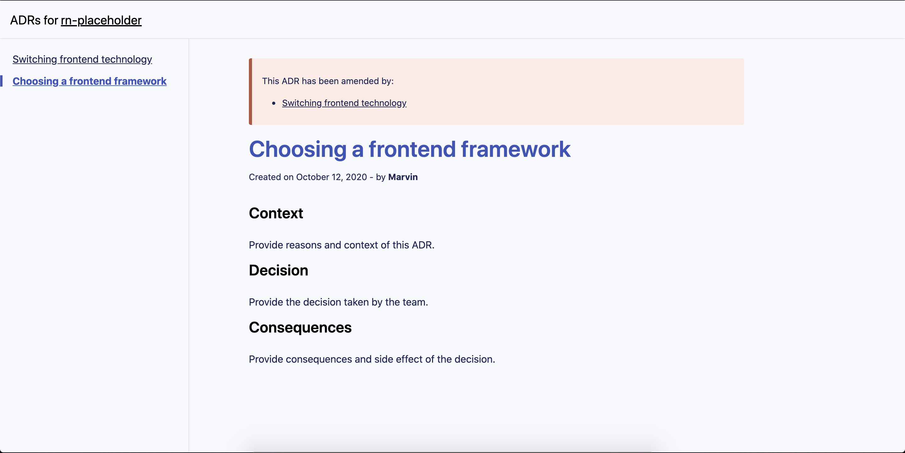

A [Gatsby](https://www.gatsbyjs.com/) template to create and manage [Architecture Decision Records](https://architecturedecisionrecord.com/). A very basic tool.


- [Why this project?](#why-this-project)
- [Installation](#installation)
- [Create a new ADR](#create-a-new-adr)
- [Amending an ADR](#amending-an-adr)
- [Referencing a Pull Request](#referencing-a-pull-request)


## Why this project?

If you've ever wondered why a system ended up the way it is, you were probably lacking context. You were lacking the reasons why the system has changed over time and which decisions have been made to get to that point. ADRs (Architecture decision records) are a way to keep track of these changes.

My personal and ideal workflow would be to reflect with my team about architectural changes and open a pull request with an ADR proposal. The pull request, in this scenario, is the tool that helps manage the status of the ADR. When an ADR proposal gets merged, it means that it has been accepted and can be applied to the real world project.

## Installation

```sh
# You need to have the gatsby-cli installed: https://www.gatsbyjs.com/docs/quick-start/
$ gatsby new my-project-name https://github.com/mfrachet/gatsby-template-adr
$ cd my-project-name
$ yarn dev # or npm run dev
```

## Create a new ADR

This template provides a tiny script to help creating ADRs using the command line. To do so, run the following command in a terminal:

```sh
$ yarn create-adr
```

And answer the questions:


## Amending an ADR

ADRs are immutable and shouldn't be modified. In order to keep track of modifications, we should **amend** an ADR and reference the ADR that needs to be amended.

You can **amend** an ADR using the CLI tool presented in [Create a new ADR](#create-a-new-adr). At some point, the CLI will ask you if you want to amend a previously created ADR.

If you prefer to amend an ADR directly in Markdown, you can use the `amend` frontmatter key to do so:

```markdown
---
title: "A very exciting ADR"
date: 2020-10-12
slug: "/a-very-exciting-adr"
author: "Marvin"
pullRequest: ""
amend: "1-Choosing-a-frontend-framework.md"
---

# This is a file that needs to be amended

Some content
```

## Referencing a Pull Request

It's possible to reference the pull request originating the ADR using the `pullRequest` frontmatter key:

```markdown
---
title: "A very exciting ADR"
date: 2020-10-12
slug: "/a-very-exciting-adr"
author: "Marvin"
pullRequest: "https://github.com/mfrachet/rn-placeholder/pull/140"
---

# This is a file that needs to be amended

Some content
```

